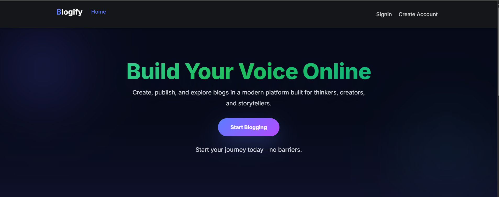
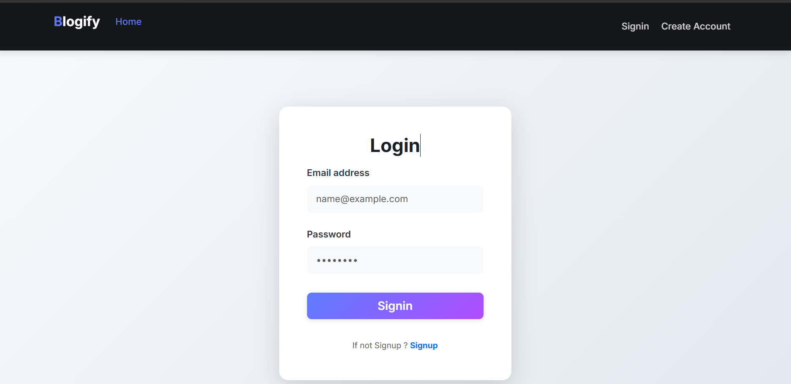
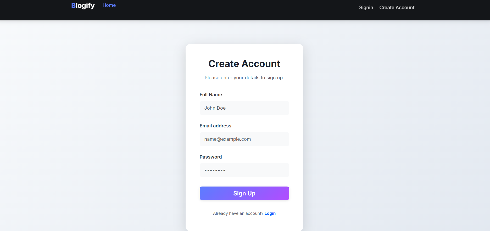
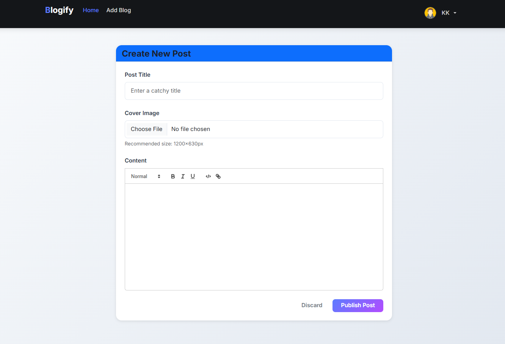
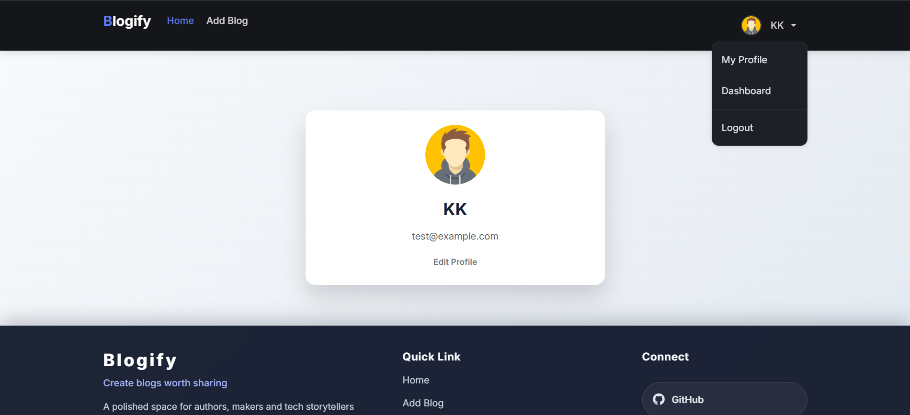
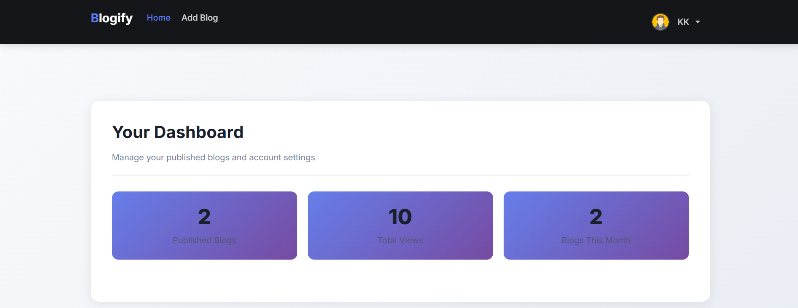
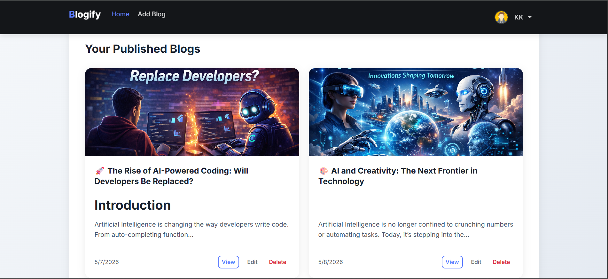
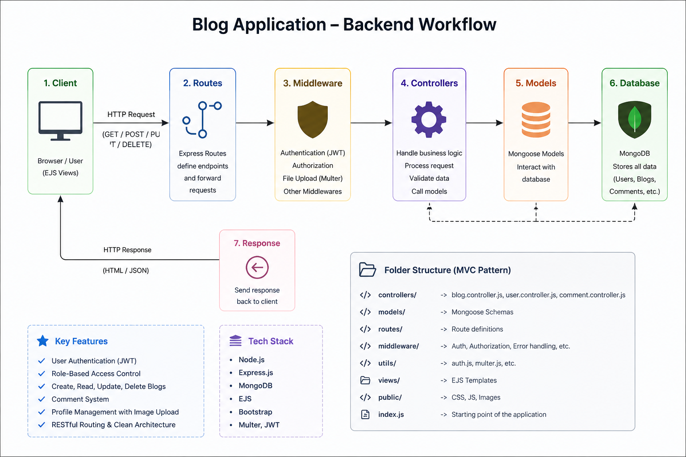

# 🚀 Blogify - Modern Blogging Platform



## 📖 Overview

**Blogify** is a modern full-stack blogging platform where users can create, publish, edit, and manage blogs with a clean and responsive user interface. The platform focuses on simplicity, modern UI design, authentication security, and a smooth blogging experience.

Built using **Node.js, Express.js, MongoDB, EJS, and Bootstrap/CSS**, Blogify allows users to:

* ✍️ Create blogs
* 📝 Edit & delete blogs
* 👤 Manage user profiles
* 💬 Add comments
* 📊 View dashboard statistics
* 🔐 Secure authentication using JWT & cookies
* 🖼️ Upload blog cover images using Multer

---

# 🌟 Features

## 🔐 Authentication System

* User Signup
* User Login
* JWT-based authentication
* Secure cookie handling
* Logout functionality

## 📝 Blog Management

* Add new blogs
* Upload blog cover images
* Edit blogs
* Delete blogs
* View full blog content

## 👤 User Profile

* Profile page
* Edit profile details
* Personalized dashboard

## 📊 Dashboard

* Total published blogs
* Monthly blog count
* Blog statistics & views

## 💬 Comment System

* Add comments to blogs
* Interactive blog discussion

## 🎨 Modern UI

* Dark modern navbar
* Gradient buttons
* Responsive cards
* Mobile-friendly design
* Clean dashboard layout

---

# 🛠️ Tech Stack

| Technology    | Usage             |
| ------------- | ----------------- |
| Node.js       | Backend Runtime   |
| Express.js    | Server Framework  |
| MongoDB       | Database          |
| Mongoose      | MongoDB ODM       |
| EJS           | Templating Engine |
| JWT           | Authentication    |
| Multer        | Image Upload      |
| Bootstrap/CSS | Frontend Styling  |
| Cookie Parser | Cookie Handling   |

---

# 📂 Project Structure

```bash
Blogify/
│
├── controller/
│   ├── blog.controller.js
│   ├── user.controller.js
│   └── comment.js
│
├── Db/
│   └── db.js
│
├── middleware/
│   └── auth.middleware.js
│
├── models/
│   ├── blog.model.js
│   ├── user.model.js
│   └── comment.model.js
│
├── public/
│   ├── css/
│   ├── images/
│   └── uploads/
│
├── routes/
│   ├── blog.route.js
│   └── user.route.js
│
├── utils/
│   ├── multer.util.js
│   └── auth.js
│
├── views/
│   ├── partials/
│   ├── home.ejs
│   ├── login.ejs
│   ├── signup.ejs
│   ├── profile.ejs
│   ├── dashboard.ejs
│   └── addBlog.ejs
│
├── index.js
├── package.json
└── README.md
```

---

# ⚙️ Installation & Setup

## 1️⃣ Clone the Repository

```bash
git clone https://github.com/imdad-dev/NodeJs-mini-projects.git
cd NodeJs-mini-projects/05_Blog_App
```

---

## 2️⃣ Install Dependencies

```bash
npm install
```

---

## 3️⃣ Create Environment Variables

Create a `.env` file in the root directory.

```env
PORT=8000
MONGO_URL=your_mongodb_connection
JWT_SECRET=your_secret_key
```

---

## 4️⃣ Start the Server

```bash
npm start
```

For development:

```bash
npm run dev
```

---

# 🌐 Routes Overview

## 👤 User Routes

| Method | Route              | Description        |
| ------ | ------------------ | ------------------ |
| GET    | /user/signup       | Render signup page |
| POST   | /user/signup       | Register user      |
| GET    | /user/login        | Render login page  |
| POST   | /user/login        | Login user         |
| GET    | /user/logout       | Logout user        |
| GET    | /user/profile      | User profile       |
| GET    | /user/dashboard    | User dashboard     |
| GET    | /user/edit-profile | Edit profile page  |
| POST   | /user/edit-profile | Update profile     |

---

## 📝 Blog Routes

| Method | Route                 | Description          |
| ------ | --------------------- | -------------------- |
| GET    | /blog/add-blog        | Render add blog page |
| POST   | /blog/add-new         | Create new blog      |
| GET    | /blog/:id             | View blog            |
| POST   | /blog/delete/:blogId  | Delete blog          |
| GET    | /blog/edit/:blogId    | Edit blog page       |
| POST   | /blog/:blogId         | Update blog          |
| POST   | /blog/comment/:blogId | Add comment          |

---

# 📸 Application Screenshots

## 🏠 Homepage Hero Section


---

## 📰 Latest Blogs Section


---

## 🔐 Login Page



---
---

## 🔐 Sign up page 



---

---

## 🔐 Add Blog



---

## 👤 User Profile



---

## 📊 Dashboard Page



---

## ✍️ Publish Blog Page



## Backend Workflow 


---

# 🔒 Authentication Flow

1. User signs up
2. Password securely stored
3. User logs in
4. JWT token generated
5. Token stored in cookies
6. Protected routes verify authentication

---

# 📦 Important Packages Used

```json
{
  "express": "^4.x",
  "mongoose": "^8.x",
  "jsonwebtoken": "^9.x",
  "cookie-parser": "^1.x",
  "multer": "^1.x",
  "dotenv": "^16.x",
  "ejs": "^3.x"
}
```

---

# 🎯 Future Improvements

* ❤️ Like & bookmark system
* 🔍 Search functionality
* 🌙 Dark/Light mode toggle
* 📱 Progressive Web App (PWA)
* 🔔 Notifications
* 📈 Advanced analytics
* 🧠 AI-powered blog suggestions

---

# 👨‍💻 Author

## Imdadul Hoque

* 💻 Full Stack Developer
* 🚀 Passionate about building modern web applications
* 🎯 Goal: Become a successful software engineer & entrepreneur

---

# 🤝 Contribution

Contributions are always welcome.

```bash
Fork the repository
Create your feature branch
Commit your changes
Push to the branch
Open a Pull Request
```

---

# 📜 License

This project is licensed under the MIT License.

---

# ⭐ Support

If you like this project:

* ⭐ Star this repository
* 🍴 Fork the project
* 🧑‍💻 Share with others

---

# 💡 Final Note

Blogify is more than just a blogging platform — it is a complete learning project that demonstrates authentication, CRUD operations, image uploads, MVC architecture, responsive UI design, and full-stack development concepts.

✨ Built with passion and consistency.
