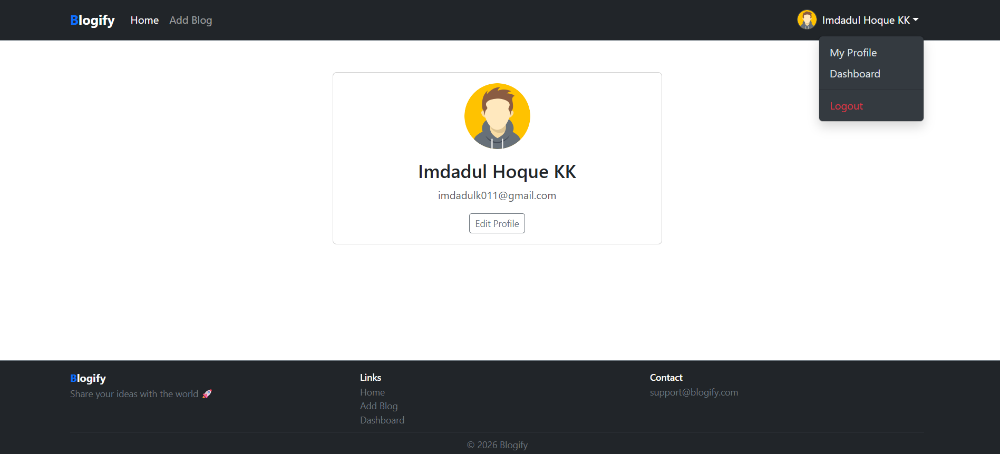
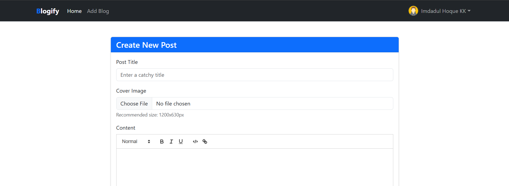

# 📝 Blog Application (Backend-Focused)

A full-stack blog platform A full-stack blog platform built using Node.js, Express.js, MongoDB, and EJS, with a strong focus on designing a clean, scalable, and maintainable backend architecture.

---

## 🚀 Features

- 🔐 User Authentication (Login / Signup)
- 🛡️ Role-Based Access Control (Public & Private Routes)
- ✍️ Create, Edit, Delete Blog Posts
- 💬 Comment System on Blogs
- 👤 User Profile Management 
- 📦 RESTful API Design
- 🧠 MVC Architecture

---

## 🏗️ Tech Stack

- **Backend:** Node.js, Express.js  
- **Database:** MongoDB  
- **Frontend:** EJS, Bootstrap  
- **Authentication:** JWT  
- **File Upload:** Multer  

---

## 📂 Project Structure

```
├── controllers/
│ ├── blog.controller.js
│ ├── user.controller.js
│ └── comment.js
│
├── models/
├── routes/
├── middleware/
├── utils/
│ ├── auth.js
│ └── multer.js
│
├── views/
│ ├── partials/
│ │ ├── head.ejs
│ │ ├── nav.ejs
│ │ ├── footer.ejs
│ │ └── quill.ejs
│ │
│ ├── home.ejs
│ ├── login.ejs
│ ├── signup.ejs
│ ├── blog.ejs
│ ├── dashboard.ejs
│ ├── edit-profile.ejs
│ └── edit-blog.ejs
│
├── public/
├── index.js
```

---

## 🔄 How Backend Works (Simple View)


This diagram shows how a request flows through the system:

Client → Routes → Middleware → Controller → Database → Response

### Explanation:
- **Client** → User sends request (browser)
- **Routes** → Decide which API to call
- **Middleware** → Auth, validation, security
- **Controller** → Main logic runs here
- **Database** → Store & fetch data (MongoDB)
- **Response** → Send data back to user

---

## 📸 Screenshots

### 🏠 Home Page


### 👤 User Profile


### ✍️ Create Blog


---

## ⚙️ Installation & Setup

```bash
# Clone the repository
git clone https://github.com/imdad-dev/NodeJs-mini-projects/tree/main/05_Blog_App.git

# Navigate into project
cd 5_Blog_App

# Install dependencies
npm install

# Create .env file and add:
PORT=8000
MONGO_URI=your_mongodb_connection_string
JWT_SECRET=your_secret_key

# Run the app
npm run dev 