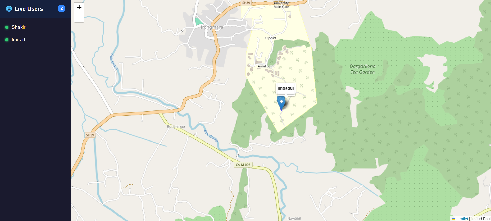
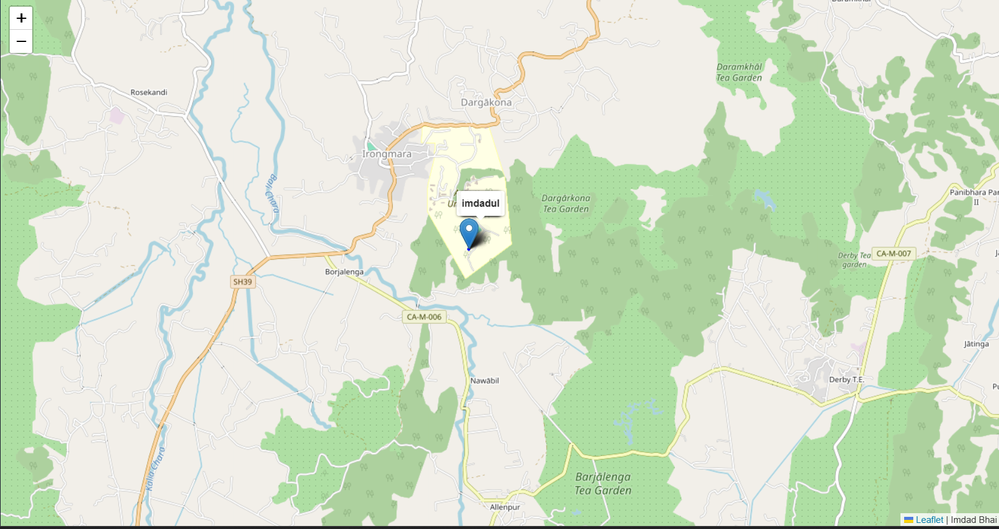
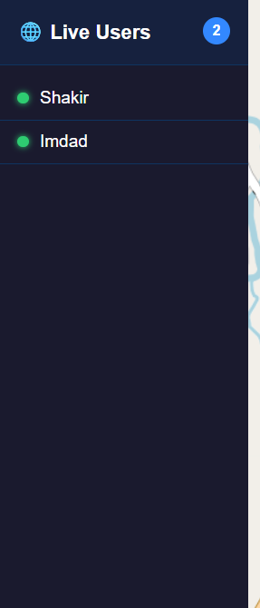

# 📍 RealTime Tracker

A **real-time device location tracking** web application built with **Node.js**, **Express**, **Socket.io**, and **Leaflet.js**. See connected users live on an interactive map — with path trails, username labels, and a live online/offline sidebar.

---

## 🚀 Features

- 🌍 **Live Location Tracking** — Tracks device GPS in real time using the browser Geolocation API
- 🗺️ **Interactive Map** — Powered by Leaflet.js with OpenStreetMap tiles
- 👤 **Username Labels** — Each user enters a name before joining; shown as a permanent label on their marker
- 🛤️ **Path Drawing** — Draws a live trail of each user's movement on the map
- 🟢 **Live User Sidebar** — Real-time online/offline list with user count badge
- ⚡ **Real-time Sync** — Instant updates to all clients via Socket.io WebSockets
- 🧹 **Auto Cleanup** — Markers, paths, and sidebar entries removed on disconnect

---

## 🛠️ Tech Stack

| Layer | Technology |
|---|---|
| Runtime | Node.js |
| Framework | Express.js |
| Real-time | Socket.io |
| Map | Leaflet.js + OpenStreetMap |
| Templating | EJS |
| Geolocation | Browser Geolocation API |

---

## 📁 Project Structure

```
09_RealTime_Tracker/
│
├── public/
│   ├── css/
│   │   └── style.css         # Styles for map, sidebar, modal
│   └── js/
│       └── script.js         # Client-side socket, map & UI logic
│
├── views/
│   └── index.ejs             # Main HTML template
│
├── app.js                    # Express + Socket.io server
├── package.json
└── README.md
```

---

## ⚙️ Getting Started

### Prerequisites

- [Node.js](https://nodejs.org/) v14 or higher
- npm

### Installation

```bash
# 1. Clone the repository
git clonehttps://github.com/imdad-dev/NodeJs-mini-projects/tree/main/09_RealTime_Tracker

# 2. Navigate into the project
cd 09_RealTime_Tracker

# 3. Install dependencies
npm install
```

### Run the App

```bash
node app.js
```

Open your browser and visit:

```
http://localhost:8000
```

> 💡 **Tip:** Open in multiple browser tabs or devices on the same network to see real-time multi-user tracking in action.

---

## 🔌 Socket.io Events

| Event | Direction | Payload | Description |
|---|---|---|---|
| `send-location` | Client → Server | `{ latitude, longitude, username }` | Emits user's current GPS coords |
| `receive-location` | Server → Client | `{ id, latitude, longitude, username }` | Broadcasts location to all clients |
| `update-user-list` | Server → Client | `[{ username }]` | Sends updated online user list |
| `user-disconnected` | Server → Client | `socket.id` | Notifies all clients of a disconnect |

---

## 🗺️ How It Works

```
1. User opens app → enters username → modal closes
2. Browser Geolocation watchPosition() starts
3. Every position update → emit send-location to server
4. Server stores user, broadcasts receive-location to all clients
5. Clients update marker position, draw path trail, refresh sidebar
6. On disconnect → server removes user, notifies all clients
7. Clients remove marker, path, and sidebar entry
```

---

## 📸 Screenshots

### 🗺️ Full Map View


### 📋 Details

| Map View | Sidebar |
|---|---|
|  |  |

---

## 🧩 Features Roadmap

- [x] Real-time GPS tracking
- [x] Interactive Leaflet map
- [x] Username labels on markers
- [x] Path/trail drawing
- [x] Live online/offline sidebar
- [ ] Distance calculator between users
- [ ] Room-based group tracking
- [ ] Geofence alerts
- [ ] User color customization

---

## 🐛 Known Issues

- Geolocation accuracy depends on the device and browser permissions
- Path history is stored in memory — resets on server restart
- Works best on HTTPS for full Geolocation API access on mobile

---

## 📄 License

This project is open source and available under the [MIT License](LICENSE).

---

## 🙌 Acknowledgements

- Lecture by **Sheryians Coding School** — [Watch on YouTube](https://youtu.be/JmpDGMgRFfo)
- [Leaflet.js](https://leafletjs.com/) — Open-source JavaScript map library
- [Socket.io](https://socket.io/) — Real-time bidirectional event-based communication
- [OpenStreetMap](https://www.openstreetmap.org/) — Free map tile provider

---

<p align="center">Built with ❤️ using Node.js & Socket.io</p>